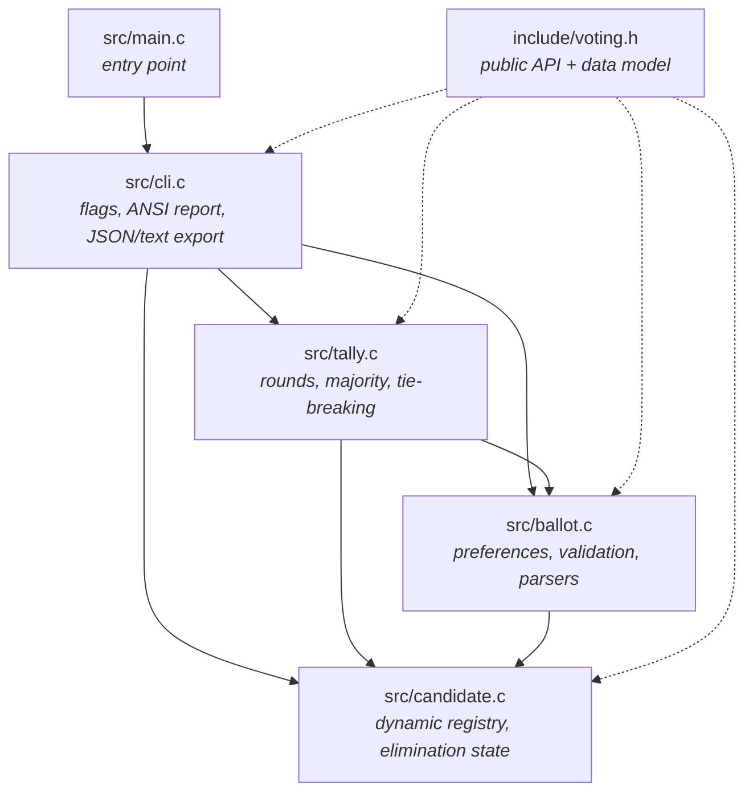

# voting-engine

[](https://github.com/rishov21-unimelb/voting-engine/actions/workflows/ci.yml)
[](https://en.wikipedia.org/wiki/C11_(C_standard_revision))
[](Makefile)
[](#build)
[](LICENSE)

A preferential voting engine in portable C11, built as a static library with a
thin command-line front end. It counts ranked ballots the way the Australian
House of Representatives does — eliminate the trailing candidate, redistribute
their preferences, repeat — and also implements Borda count and
first-past-the-post so the same ballots can be scored three different ways.

The interesting part is that those three ways disagree. On the sample election
shipped in `examples/`:

| System | Winner | Why |
| --- | --- | --- |
| `--system=plurality` | **Anand** | most first preferences (43 of 131) |
| `--system=instant-runoff` | **Bianchi** | overtakes Anand once Eriksson and Duong are cut |
| `--system=borda` | **Bianchi** | broad second-preference support, 360 points |

```
$ vote --system=instant-runoff examples/election.txt

Election
  candidates : 5
  ballots    : 131
  system     : instant-runoff

Round 1
  Anand             43 votes   32.8%  ########................
  Bianchi           34 votes   26.0%  ######..................
  Castellanos       22 votes   16.8%  ####....................
  Duong             18 votes   13.7%  ###.....................
  Eriksson          14 votes   10.7%  ###.....................
  ----
  Eriksson is eliminated, votes distributed

Round 2
  Bianchi           45 votes   34.4%  ########................
  Anand             43 votes   32.8%  ########................
  Castellanos       22 votes   16.8%  ####....................
  Duong             21 votes   16.0%  ####....................
  ----
  Duong is eliminated, votes distributed

Round 3
  Bianchi           66 votes   50.4%  ############............
  Anand             43 votes   32.8%  ########................
  Castellanos       22 votes   16.8%  ####....................
  ----
  Bianchi is declared elected

Result
  Bianchi elected in round 3 with 66 votes (50.4%)
```

---

## Contents

- [Architecture](#architecture)
- [Key technical features](#key-technical-features)
- [Build](#build)
- [Testing and memory safety](#testing-and-memory-safety)
- [CLI usage](#cli-usage)
- [Input formats](#input-formats)
- [Using the library](#using-the-library)
- [Counting rules](#counting-rules)
- [Project layout](#project-layout)
- [License](#license)

---

## Architecture

Every module depends only on the public header, so the engine can be linked
into another program without dragging the terminal front end along with it.



The same structure, without a Mermaid renderer:

```
                         +---------------------+
                         |     src/main.c      |   argc/argv only
                         +----------+----------+
                                    |
                         +----------v----------+
                         |      src/cli.c      |   flags, rendering, export
                         +----+----------+-----+
                              |          |
              +---------------v--+    +--v----------------+
              |   src/tally.c    |    |   src/ballot.c    |
              |  rounds, majority|--->| preferences, I/O  |
              |  tie-breaking    |    | text / csv / json |
              +---------+--------+    +---------+---------+
                        |                       |
                        +-----------+-----------+
                                    |
                        +-----------v-----------+
                        |   src/candidate.c     |   registry + elimination
                        +-----------------------+

                  include/voting.h  --  the only shared contract
                  build/libvoting.a --  everything except main()
```

Data model, all of it in `include/voting.h`:

```
Election
├── CandidateSet        auto-resizing array of Candidate
│   └── Candidate       { name, index, eliminated, eliminated_round }
└── Ballot              auto-resizing array of Vote
    └── Vote            { Preferences, id }
        └── Preferences { ranks[], len }   ranks[i] = rank given to candidate i

ElectionResult
└── ElectionStage[]     one per counting round
    ├── TallyEntry[]    active candidates, sorted by score descending
    └── outcome         decided / winner / eliminated / tie_broken
```

Ballots are stored **positionally**: `ranks[i]` is the preference the voter gave
to the candidate registered at index `i`. Redistribution after an elimination
therefore rewrites nothing — the count simply skips eliminated indices, and each
round is a flat scan over contiguous memory.

---

## Key technical features

**Dynamic memory, no fixed ceilings.** Candidates and ballots live in
geometrically growing arrays behind a single `vote_reserve()` helper that
returns the moved block rather than writing back through a `void **` (which
would store a `void *` into an object of another pointer type). Growth is
overflow-checked against `SIZE_MAX` before every `realloc`, and a failed grow
leaves the original allocation intact so the caller can bail out without
leaking. The suite counts 50,000 ballots over 16 candidates to prove the point.

**Data encapsulation.** `include/voting.h` is the whole contract: opaque-ish
value types, a `vote_status_t` returned from every fallible call, and clear
ownership rules stated at the top of the header. Internal helpers shared
between translation units live in `src/internal.h` and never reach the public
surface. Everything except `main()` compiles into `build/libvoting.a`, so the
CLI, the tests and any future front end all link the identical objects.

**Hand-written parsers, zero dependencies.** Three input formats — the classic
whitespace layout, CSV, and JSON — parsed from a fully buffered copy of the
stream, which lets format sniffing work without ever pushing characters back.
The JSON reader is a small recursive-descent parser with full string-escape
handling including `\uXXXX` and surrogate-pair recombination into UTF-8.

**Input hardening.** Ballots are validated before they are stored, so a rejected
ballot leaves the election exactly as it was. A preference ordering must use
each rank at most once and its non-blank ranks must form the contiguous run
`1..k` — anything else is ambiguous the moment a candidate is eliminated.
Integer fields are parsed digit by digit with an explicit overflow guard rather
than by trusting `scanf`, name length and candidate count are bounded, and
parse failures report the offending line number. The suite feeds sixteen
malformed files through the readers and requires every one to be refused.

**Pointer arithmetic done carefully.** The line scanner and field iterators
hand back `(pointer, length)` slices into the input buffer instead of copying,
with every walk bounded by an explicit `end` pointer rather than a NUL scan.

**Deterministic tie-breaking.** Level candidates are separated by fewest first
preferences overall, then by registration order, so the same input always
produces the same transcript — and the transcript records that a tie-break
happened.

**Portability.** C11 with no POSIX assumptions: the engine carries its own
`strdup` and case-insensitive compare rather than reaching for the POSIX
versions that `-std=c11 -pedantic` hides. CRLF input parses identically to LF.
Colour is auto-detected from `isatty` and honours [`NO_COLOR`](https://no-color.org).
Builds clean under GCC and Clang with `-Wall -Wextra -Werror -pedantic`.

---

## Build

No dependencies beyond a C11 compiler and `make`.

```sh
git clone https://github.com/rishov21-unimelb/voting-engine.git
cd voting-engine
make                       # build/vote and build/libvoting.a
./build/vote examples/election.txt
```

| Target | What it does |
| --- | --- |
| `make` / `make all` | optimised binary + static library |
| `make debug` | `-O0 -g3` build in `build/debug` (add `SANITIZE=1` for ASan/UBSan) |
| `make test` | build and run the unit suite |
| `make sanitize` | run the suite under AddressSanitizer and UndefinedBehaviorSanitizer |
| `make valgrind` | run the suite and three sample elections under Valgrind |
| `make install` | install binary, library and header under `PREFIX` (default `/usr/local`) |
| `make clean` | remove `build/` |

Compiler flags are strict by default:

```
-std=c11 -Wall -Wextra -Werror -pedantic -Wshadow -Wstrict-prototypes
-Wmissing-prototypes -Wold-style-definition -Wvla -Wpointer-arith -Wcast-qual
```

On Windows, build with MSYS2/MinGW: `mingw32-make CC=gcc`.

---

## Testing and memory safety

```sh
$ make test
voting-engine 1.0.0 test suite

- candidate registration, lookup and duplicate rejection
- registry grows past any fixed-size limit
- free is idempotent
- preference orderings are validated before they are stored
- a rejected ballot leaves the election untouched
- majority needs strictly more than half
- eliminating the trailing candidate redistributes their votes
- exhausted ballots leave the denominator
- tied candidates are cut in a deterministic order
- a tie is broken on first preferences before ordering
- borda scores positions rather than first preferences
- text format
- csv format, including blank cells
- json format, positional and name-ordered ballots
- malformed input is rejected without crashing
- a missing file is an i/o error, not a crash
- long names and wide ballots are handled
- json export escapes names and round-trips the transcript
- cli spellings map to the right engine settings
- 50,000 ballots over 16 candidates

440 checks, 0 failed
OK
```

`tests/test_voting.c` is a self-contained harness — a counter and four macros,
no framework, no dependencies. A failed check records itself and the suite keeps
going, so one broken assumption never hides the rest.

Memory safety is part of the build contract and is enforced in CI on every push:

```sh
make valgrind    # zero leaks, zero invalid reads/writes, errors are fatal
make sanitize    # the same suite under ASan + UBSan, -fno-sanitize-recover
```

`make valgrind` runs with `--leak-check=full --show-leak-kinds=all
--errors-for-leak-kinds=all --error-exitcode=1`, so any leak at all fails the
build rather than printing a warning nobody reads.

---

## CLI usage

```
Usage: vote [OPTIONS] [FILE]

Reads an election from FILE, or from standard input when FILE is
omitted or given as "-".

Options:
  -s, --system=NAME   instant-runoff (default), borda, plurality
  -f, --format=NAME   auto (default), text, csv, json
  -e, --export=FILE   write the outcome to FILE (.json for JSON,
                      otherwise plain text; "-" for stdout)
      --color=WHEN    auto (default), always, never
  -i, --interactive   prompt for candidates and ballots
  -q, --quiet         print only the final result
  -h, --help          show this help and exit
  -V, --version       show the version and exit
```

```sh
# count a file, format detected from its contents
vote examples/election.txt

# score the same ballots three ways
vote --system=instant-runoff examples/election.csv
vote --system=borda          examples/election.csv
vote --system=plurality      examples/election.csv

# machine-readable transcript for a dashboard or a diff
vote --system=borda --export=results.json examples/election.json

# pipe it, and skip the round-by-round transcript
cat ballots.csv | vote --format=csv --quiet

# type an election in by hand
vote --interactive
```

Both `--flag=value` and `--flag value` are accepted. Exit status is `0` when a
candidate was elected, `1` on a parse error, a bad flag, or an election that
nobody could win.

The exported JSON carries the full transcript, not just the winner:

```json
{
  "generator": "voting-engine 1.0.0",
  "system": "instant-runoff",
  "ballots": 131,
  "candidates": ["Anand", "Bianchi", "Castellanos", "Duong", "Eriksson"],
  "decided": true,
  "winner": "Bianchi",
  "rounds": [
    {
      "round": 1,
      "total": 131,
      "exhausted": 0,
      "tally": [
        {"candidate": "Anand", "score": 43, "share": 0.3282},
        {"candidate": "Bianchi", "score": 34, "share": 0.2595}
      ],
      "eliminated": "Eriksson",
      "tie_broken": false,
      "elected": null
    }
  ]
}
```

---

## Input formats

All three describe the same election, and `--format=auto` picks between them
from the file extension and then the content.

**Text** — the classic layout. Blank lines and `#` comments are ignored.

```
# candidate count, then that many names, then one ballot per line
3
Alice
Bob
Carol
1 2 3
2 1 3
3 2 1
```

**CSV** — header row of candidate names, one ballot per row. An empty cell
means "left blank".

```csv
Alice,Bob,Carol
1,2,3
2,1,3
,1,2
```

**JSON** — a ballot may be positional ranks *or* candidate names listed
most-preferred first, and the reader accepts either in the same file.

```json
{
  "candidates": ["Alice", "Bob", "Carol"],
  "ballots": [
    [1, 2, 3],
    [2, 1, 3],
    ["Carol", "Bob"]
  ]
}
```

In every format a rank of `0` (or a name simply left off a JSON ballot) means
unranked. Ranks that are used must run `1, 2, 3, …` without gaps or repeats.

---

## Using the library

`build/libvoting.a` plus `include/voting.h` is the whole interface.

```c
#include "voting.h"

int main(void)
{
    Election       election;
    ElectionResult result;

    vote_election_init(&election);
    if (vote_read_file(&election, "ballots.csv", VOTE_FORMAT_AUTO, NULL)
        != VOTE_OK) {
        vote_election_free(&election);
        return 1;
    }

    if (vote_election_run(&election, VOTE_SYSTEM_INSTANT_RUNOFF, &result)
        == VOTE_OK && result.decided) {
        printf("%s wins after %lu rounds\n",
               vote_candidate_at(&election, result.winner)->name,
               (unsigned long)result.count);
    }

    vote_result_free(&result);
    vote_election_free(&election);
    return 0;
}
```

```sh
cc -Iinclude myprogram.c build/libvoting.a -o myprogram
```

Elections can also be built in memory, without any file at all:

```c
vote_candidate_add(&election, "Alice", NULL);
vote_candidate_add(&election, "Bob", NULL);

const unsigned prefs[] = { 1u, 2u };          /* Alice first, Bob second */
vote_ballot_add(&election, prefs, 2);          /* validated before storing */
```

The round-level primitives — `vote_tally_round`, `vote_tally_majority`,
`vote_tally_lowest` — are public too, so a caller can drive the count itself and
apply its own tie-break policy.

---

## Counting rules

**Instant-runoff.** Each ballot contributes one vote to its highest-ranked
candidate still standing. A candidate needs *strictly* more than half to be
elected — an exact 50/50 split is not a win. Otherwise the lowest-scoring
candidate is eliminated and the next round redistributes their support.

Ballots whose every preference has been eliminated become **exhausted** and
leave the denominator, which is how a real distributive count works. It changes
outcomes: in the test suite, a candidate holding 6 of 11 live ballots is
elected, where against a frozen denominator of 15 nobody would ever reach a
majority.

**Borda.** Single round, positional scoring. On a ballot over `n` candidates the
one ranked `r` collects `n - r` points, so a first preference is worth `n - 1`
and the last is worth nothing.

**Plurality.** Single round, first preferences only, highest total wins whether
or not it is a majority.

**Tie-breaking.** When candidates are level for elimination, the engine cuts
whoever attracted the fewest first preferences across all ballots; if that is
also level, the earliest-registered goes. The choice is recorded as
`tie_broken` in the transcript and in the exported JSON, so a close count is
auditable rather than silent.

---

## Project layout

```
voting-engine/
├── include/voting.h        public API, data model, status codes
├── src/
│   ├── candidate.c         registry, lookup, elimination state
│   ├── ballot.c            preferences, validation, text/CSV/JSON readers
│   ├── tally.c             rounds, majority tests, tie-breaking
│   ├── cli.c               flags, ANSI report, JSON/text export
│   ├── main.c              entry point
│   └── internal.h          helpers shared between modules, not exported
├── tests/test_voting.c     unit suite (no framework)
├── examples/               the same election in all three formats
├── .github/workflows/ci.yml  GCC + Clang, Valgrind, ASan/UBSan
├── Makefile
└── README.md
```

---

## Background

This began as a University of Melbourne assignment: a single 500-line file
counting a House of Representatives election out of `scanf` into three fixed
global arrays capped at 10 candidates, 1000 voters and 20-character names. The
counting logic was correct; everything around it was coursework scaffolding.

The rewrite keeps the algorithm and replaces the scaffolding — dynamic
structures instead of fixed arrays, a library with an explicit API instead of
globals, validated parsers for three formats instead of `scanf`, additional
voting systems, a test suite, and a build that treats warnings and memory
errors as failures.

## License

MIT — see [LICENSE](LICENSE).
